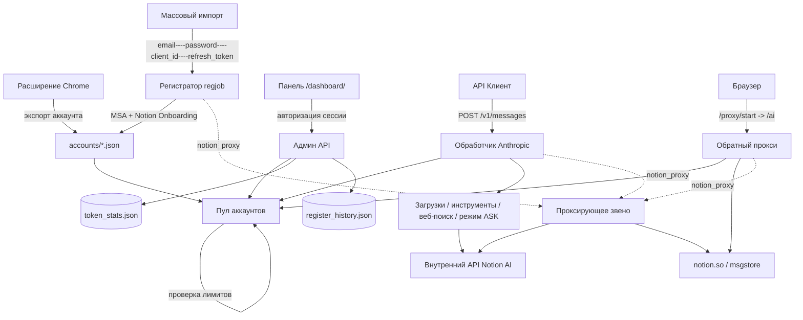

<div align="center">
  <h1>ВАЙБ КОДЕР (VIBE CODER)</h1>
  <p><strong>Локальный пул аккаунтов, кибер-панель управления и API-прокси для Notion AI</strong></p>
  <p>Запуск нескольких сессий Notion под единой локальной точкой входа с пулом аккаунтов, мониторингом лимитов, кастомной киберпанк-панелью на русском языке, Anthropic-совместимым API, автоматической массовой регистрацией через Microsoft SSO и полной интеграцией с Claude Code.</p>

  <p>
    
    
    
    
    
  </p>

  <p>
    <a href="https://t.me/abuz_ai" target="_blank">
      
    </a>
    <a href="https://youtube.com/channel/UC15FjPfHK0F6TpUHJpCfINA?si=sPZ1eTUe7samELP3" target="_blank">
      
    </a>
  </p>

  <p>
    <a href="#быстрый-старт">Быстрый старт</a> •
    <a href="#основные-возможности">Основные возможности</a> •
    <a href="#архитектура">Архитектура</a> •
    <a href="#установка-и-настройка">Настройка</a> •
    <a href="#документация">Документация</a>
  </p>

  <p>
    <strong>Русский</strong>
  </p>
</div>

---

<p align="center">
  
</p>

**ВАЙБ КОДЕР (notion-manager)** — это локальный инструмент для управления Notion AI. Он импортирует активные сессии Notion через встроенное расширение Chrome (или регистрирует новые аккаунты пачками через Microsoft-SSO), объединяет их в умный пул, обновляет лимиты и состояние моделей в фоновом режиме, а также предоставляет 4 ключевые точки доступа:

- **Панель управления (Dashboard)** по адресу `/dashboard/` — полностью русифицированный киберпанк-интерфейс, графики потребления токенов, логгер и форма массовой регистрации.
- **Обратный прокси (Reverse Proxy)** для полноценного веб-интерфейса Notion AI по адресу `/ai`.
- **API Шлюз** — `POST /v1/messages` (совместимый с Anthropic), `POST /v1/chat/completions` (OpenAI), `POST /v1/responses` и `GET /v1/models` (с поддержкой новейших **Opus 4.8** и **GPT-5.5** прямо из коробки!).
- **Массовый регистратор** по адресу `POST /admin/register/start`.
- **Health Check** по адресу `GET /health` — мониторинг состояния пула аккаунтов (см. [Health Check & Observability](docs/health.md)).

> **⚠️ Предупреждение о безопасности (Security Warning)**: Никогда не сохраняйте в систему контроля версий (git) реальные файлы `config.yaml` или данные аккаунтов (`.json` файлы из папки `accounts/`). Они содержат конфиденциальные токены доступа.

---

## Быстрый старт

> **Требования:** Go 1.25+, как минимум один аккаунт Notion. Расширение для Chrome не требуется, если вы добавляете аккаунты вручную через панель или регистрируете их в автоматическом режиме.

Если вы хотите запустить проект из исходного кода:

```bash
# 1. Клонируйте репозиторий и перейдите в папку
git clone https://github.com/b24039971/notion-abuz_ai.git
cd notion-abuz_ai

# 2. Запустите компиляцию и сервер (конфигурация создастся автоматически)
go run ./cmd/notion-manager
```

Или просто запустите уже скомпилированный бинарный файл для Windows:
```powershell
.\notion-manager.exe
```

При первом запуске консоль сгенерирует и выведет ваш **пароль администратора** и **API-ключ** — обязательно сохраните их!

```bash
# 3. Откройте русифицированную кибер-панель
http://localhost:8081/dashboard/
```

**Добавьте ваш первый аккаунт** (на выбор):
- **Существующая сессия Notion** — откройте `notion.so` в Chrome → нажмите `F12` → перейдите во вкладку **Application (Приложение)** → **Cookies** → скопируйте значение `token_v2`. В панели управления нажмите **「+ Добавить аккаунт」** и вставьте токен.
- **Массовая регистрация (Microsoft-SSO)** — в панели нажмите **「Регистрация аккаунтов」** и вставьте строки вида `email----password----client_id----refresh_token`.

Пул автоматически обновится и подхватит аккаунт сразу после сохранения JSON-файла в папке `accounts/` — перезапуск сервера не требуется.

```bash
# 4. Настройте клиенты (Claude Code, Cherry Studio, Cursor и др.)
export ANTHROPIC_BASE_URL=http://localhost:8081
export ANTHROPIC_API_KEY=<ваш-api-ключ>

# Для OpenAI-совместимых клиентов:
export OPENAI_BASE_URL=http://localhost:8081/v1
export OPENAI_API_KEY=<ваш-api-ключ>
```

---

## Основные возможности

### Умный пул аккаунтов
- Загрузка любого количества JSON-файлов аккаунтов из папки `accounts/`.
- Выбор аккаунта на основе реального остатка лимитов (quota) вместо случайного перебора.
- Динамическая проверка лимита перед каждым запросом (кэшируется на указанное в настройках время), что исключает отправку запроса на исчерпанный аккаунт.
- Автоматический пропуск заблокированных аккаунтов или аккаунтов без рабочих пространств.
- Полная синхронизация оставшихся лимитов и доступных моделей обратно в JSON-файлы.

### Русифицированная кибер-панель (Dashboard)
- Эстетичный **фронтенд в стиле Matrix / Cyberpunk** с мягким зеленым свечением и поддержкой вашего логотипа.
- Авторизация по сгенерированному ключу сессии.
- Удобный список пула с серверным поиском, сортировкой и пагинацией.
- Действия в один клик: запуск прокси веб-интерфейса, копирование токена, удаление аккаунта.
- Детальная статистика расхода токенов — общие лимиты, затраты за сегодня, за последние 24 часа, 30-дневные графики, топ используемых моделей и аккаунтов.
- Быстрые переключатели: **Поиск в сети**, **Поиск в раб. пространстве**, **Режим ASK** (без записи в страницы) и **Логи отладки**.
- Готовая интеграция с новейшими моделями **Opus 4.8** и **GPT-5.5** (автоматический умный маппинг на внутренние эндпоинты Notion AI).

### Обратный прокси для Notion Web
- Запуск целевой сессии проксирования через `/proxy/start`.
- Доступ к полному веб-интерфейсу Notion AI локально через эндпоинт `/ai` с автоматической подстановкой куки из пула аккаунтов.
- Проксирование HTML, API-запросов, статики, хранилища сообщений и WebSocket-трафика.
- Автоматический обход зависаний интерфейса Notion на пустых/неинициализированных рабочих пространствах (возврат статуса `409` для отображения ошибки в панели).

### Совместимость с API (Anthropic + OpenAI)
- Поддержка стриминга (потоковой выдачи токенов) для мгновенного отображения ответов.
- Поддержка инструментов (Tools) и вызовов функций (Function Calling) как в стиле Anthropic, так и OpenAI.
- Загрузка изображений, PDF и CSV файлов с интеграцией во внутренний пайплайн Notion.
- **Режим ASK** — добавьте суффикс `-ask` к любой модели (например, `sonnet-4.6-ask` или `opus-4.8-ask`) для разовых быстрых ответов без создания мусорных блоков в документах.
- **Model Aliases & Reasoning Effort**: Вы можете настроить собственные алиасы моделей в `config.yaml` (`model_map`). Клиенты (такие как OpenCode) могут запрашивать эти алиасы напрямую (например, `model="opus-4.8-high"`) или использовать автоматический роутинг через параметр `reasoning_effort`. Подробности см. в [Документации по конфигурации](docs/configuration.md#model-map--reasoning-effort-routing).

---

### Интеграция с Claude Code

Прокси полностью совместим с **[Claude Code](https://docs.anthropic.com/en/docs/claude-code)** — официальным терминальным агентом Anthropic. Поддерживается многошаговый вызов инструментов, работа с файлами, выполнение команд в шелле и режим глубокого размышления (extended thinking) через специальный [трехслойный мост совместимости](docs/claude-code-integration.md).

<p align="center">
  <br>
  <em>Claude Code анализирует архитектуру проекта на русском языке через Вайб Кодер с сохранением контекста сессии</em>
</p>

Для запуска достаточно прописать переменные окружения:
```bash
export ANTHROPIC_BASE_URL=http://localhost:8081
export ANTHROPIC_API_KEY=your-api-key
claude  # Запуск интерактивной сессии
```

---

## Архитектура



---

## Установка и настройка

### 1. Подготовка аккаунтов
Пул просто загружает все корректные `.json` файлы из директории `accounts/`.

#### Вариант А — Через расширение Chrome (для готовых сессий)
1. Откройте `chrome://extensions` в браузере.
2. Включите **Режим разработчика** (Developer mode).
3. Нажмите **Загрузить распакованное расширение** (Load unpacked) и выберите папку `chrome-extension/`.
4. Откройте ваш рабочий кабинет `https://www.notion.so/`.
5. Кликните на иконку расширения, скопируйте сгенерированный JSON и сохраните его в файл `accounts/misha.json`.

#### Вариант Б — Автоматическая регистрация (Microsoft-SSO)
Вы можете использовать встроенный в дашборд модуль регистрации или консольную утилиту:
```bash
# Использование CLI
notion-manager-register -accounts ./accounts -input credentials.txt
```
Формат входного файла:
```text
email----password----client_id----refresh_token
```

### 2. Конфигурация `config.yaml`
Вы можете скопировать пример файла:
```bash
cp example.config.yaml config.yaml
```
Или пропустить этот шаг — сервер автоматически сгенерирует `config.yaml` при первом старте с безопасными случайными ключами.

---

## Сообщество и поддержка

Присоединяйтесь к нашим сообществам для получения свежих обновлений, гайдов и поддержки:
- **Telegram-канал**: [t.me/abuz_ai](https://t.me/abuz_ai) — абуз нейросетей, полезный софт, инсайды и общение.
- **YouTube-канал**: [Вайб Кодер](https://youtube.com/channel/UC15FjPfHK0F6TpUHJpCfINA?si=sPZ1eTUe7samELP3) — обзоры, инструкции по установке и настройке.

---

## Разработчики

- **b24039971** ([Abuz_ai](https://github.com/b24039971)) — Основатель и главный разработчик.
- **Omnividente** ([Omnividente](https://github.com/Omnividente)) — Со-разработчик, автор улучшенной версии прокси и интеграции ИИ-агентов.
- **m86470138-bot** ([m86470138-bot](https://github.com/m86470138-bot)) — Со-разработчик.

---

## Лицензия

Этот проект распространяется под лицензией **[CC BY-NC-SA 4.0](https://creativecommons.org/licenses/by-nc-sa/4.0/)**. Допускается только некоммерческое использование.
